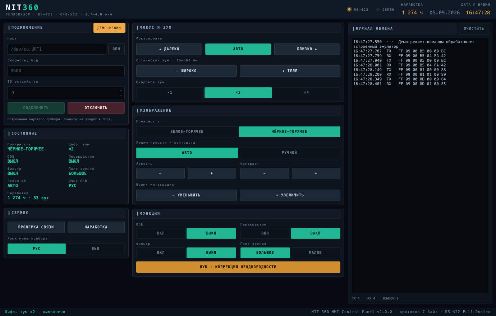

# NIT-360 HMI

Пульт управления тепловизором **NIT-360** по USB↔RS-422. Интерфейс полностью на русском.



Две независимые реализации одной и той же панели:

| | Технологии | Сборка |
|---|---|---|
| **Electron** | Node.js, Socket.IO, HTML/CSS/JS без сборщика | portable `.exe`, AppImage (electron-builder) |
| **Qt** (`pyside/`) | Python 3.11+, PySide6, pyserial | portable `.exe`, AppImage (PyInstaller) |

Обе говорят с прибором одним протоколом и умеют работать без железа — во встроенном
демо-режиме команды обрабатывает эмулятор прибора.

## Возможности

- Фокус (авто, дальше/ближе), оптический зум 18–360 мм, цифровой зум ×1/×2/×4
- Полярность, авто/ручной режим яркости и контраста, время интеграции
- DDE, перекрестие, фильтр, поле зрения, НУК (коррекция неоднородности)
- Язык меню прибора (РУС/ENG), проверка связи
- Наработка прибора: свыше ресурса 10 000 ч подсвечивается красным и помечается «ВНЕ ГАРАНТИИ»
- Журнал обмена по кадрам с счётчиками TX/RX/ошибок

## Запуск из исходников

Версия на Electron:

```bash
npm install
npm start
```

Версия на Qt:

```bash
python3 -m venv .venv
./.venv/bin/python -m pip install -r pyside/requirements.txt
./.venv/bin/python pyside/main.py          # --demo сразу в демо-режим
```

## Сборка релиза

PyInstaller и electron-builder не кросс-компилируют — собирать нужно на целевой ОС.

```bash
npm run build:exe                                                            # Electron → Windows
npm run build:appimage                                                       # Electron → Linux
powershell -ExecutionPolicy Bypass -File pyside\packaging\build_windows.ps1   # Qt → dist\NIT-360-HMI.exe
./pyside/packaging/build_linux.sh                                            # Qt → dist/NIT-360-HMI-x86_64.AppImage
```

Подробности и подводные камни (SmartScreen, группа `dialout`, версия glibc) —
[pyside/packaging/README.md](pyside/packaging/README.md).

## Протокол

Кадр — 7 байт: `FF <id> 00 <код> <параметр> 00 <XOR байтов 1..5>`, ответ такой же длины.
Порт: 9600 бод, 8N1, ID прибора `0x09`. Одна команда в эфире за раз, таймаут ответа 2 с,
ответ сверяется с кодом запроса.

У команд-запросов данных (`get_runtime`) байт `data[4]` — не статус, а старший байт
16-битного значения, поэтому статус у таких ответов не проверяется. Подробности —
[CLAUDE.md](CLAUDE.md).

## Тесты

```bash
npm test                                   # кодек протокола, JS
./.venv/bin/python pyside/test_protocol.py # кодек протокола, Python
```

## Требования к железу

USB↔RS-422 преобразователь с драйвером (CH340, FTDI, Prolific). В Linux пользователь
должен состоять в группе `dialout`.
